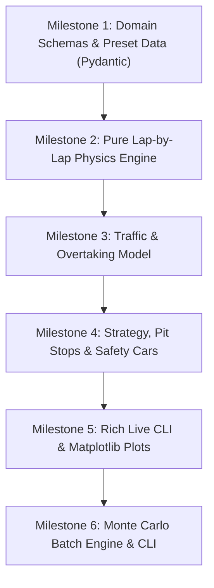

# F1 Race Simulation Engine (`f1-sim`) — Requirements Specification

## 1. Executive Summary & Vision
`f1-sim` is a modular, high-performance Formula 1 race simulation package written in Python 3.13+. It provides a **lap-by-lap discrete event simulation engine** that models the strategic, physical, and competitive dynamics of Grand Prix racing.

The package balances analytical depth with accessibility:
1. **Interactive Rich CLI**: A live terminal-based spectator and race-engineer interface with real-time leaderboard tickers, tire tracking, and incident commentary.
2. **High-Speed Python API & Monte Carlo Engine**: A vectorized, seed-deterministic framework capable of simulating thousands of races per minute for strategy evaluation, counterfactual analysis, and predictive modeling.
3. **Batteries-Included F1 Presets**: Pre-configured datasets for modern F1 teams, drivers, and iconic circuits, alongside full support for custom JSON/YAML configurations.

---

## 2. Core Functional Requirements

### 2.1 Simulation Fidelity: Lap-by-Lap Discrete Event Model
The simulation advances in discrete increments of **1 lap**. At each lap step, the engine computes every car's lap time, updates car/tire states, evaluates traffic and overtaking interactions, and triggers race control events.

#### A. Lap Time Formula (Deterministic Clean Air)
In clean air (when an interval $> 1.5\text{s}$ separates a car from the car ahead), lap times are **strictly deterministic and consistent**. Random lap-to-lap variance ($\epsilon$) is eliminated; lap times in clean air are exact, repeatable functions of car performance, driver pace rating, fuel load, and tire degradation.

For driver $i$ on lap $l$:
$$\text{LapTime}_{i, l} = T_{\text{base}} + \Delta t_{\text{car}} + \Delta t_{\text{driver}} + \Delta t_{\text{fuel}} + \Delta t_{\text{tire}} + \Delta t_{\text{traffic}} + \Delta t_{\text{incident}}$$

In clean air ($\Delta t_{\text{traffic}} = 0$ and $\Delta t_{\text{incident}} = 0$):
$$\text{LapTime}_{\text{clean}} = T_{\text{base}} + \Delta t_{\text{car}} + \Delta t_{\text{driver}} + \Delta t_{\text{fuel}} + \Delta t_{\text{tire}}$$

Where:
- **Base Track Lap Time ($T_{\text{base}}$)**: Clean air benchmark time for the circuit on optimum conditions.
- **Car Performance Delta ($\Delta t_{\text{car}}$)**: Deterministic offset derived from constructor power unit output, aerodynamic downforce, drag coefficient, and mechanical grip.
- **Driver Skill Delta ($\Delta t_{\text{driver}}$)**: Deterministic driver pace offset based on raw pace rating and tire conservation factor (no stochastic per-lap noise).
- **Fuel Mass Delta ($\Delta t_{\text{fuel}}$)**:
  - Fuel load begins at race capacity (e.g., $105\text{ kg}$).
  - Lap-by-lap burn rate: $M_{\text{fuel}}(l) = M_{\text{fuel}}(l-1) - \text{burn\_rate}$.
  - Fuel time penalty: $\Delta t_{\text{fuel}} = M_{\text{fuel}}(l) \times \text{fuel\_penalty\_factor}$ (approx. $0.033\text{s per kg}$).
- **Tire Wear Delta ($\Delta t_{\text{tire}}$)**:
  - Default compounds: Soft (C3–C5), Medium (C2–C4), Hard (C1–C3), with custom compounds supported via config presets.
  - Compound baseline grip: $\Delta t_{\text{Soft}} < \Delta t_{\text{Medium}} < \Delta t_{\text{Hard}}$ when fresh.
  - Deterministic degradation curve:
    $$\Delta t_{\text{tire}}(\text{age}) = \text{base\_compound\_delta} + (k_{\text{wear}} \cdot \text{age}) + k_{\text{cliff}} \cdot \max(0, \text{age} - \text{cliff\_lap})^2$$
  - Tire thermal wear accelerated when following in dirty air traffic.

#### B. Traffic and Overtaking Dynamics
- **Interval Tracking**: The engine tracks on-track cumulative race time to calculate the interval to the car directly ahead.
- **Dirty Air Penalty**: If interval $\le 1.5\text{s}$, downforce drops by a configurable percentage, slightly increasing lap time and accelerating tire wear.
- **Overtake Resolution**:
  - When car $B$ is behind car $A$ within striking range (interval $\le 1.0\text{s}$), overtake probability is governed **purely by the pace offset** ($\Delta \text{Pace} = \text{LapTime}_A - \text{LapTime}_B$).
  - **No Driver Skill In Overtaking**: Driver skill ratings (overtaking/defending) are completely excluded from the overtake probability calculation.
  - **Pace Offset Model**:
    $$P(\text{Overtake}) = \frac{1}{1 + e^{-k \cdot (\Delta \text{Pace} - \Delta_{\text{thresh}})}}$$
    Where:
    - $\Delta \text{Pace}$ is the net pace advantage of the trailing car over the lead car.
    - $\Delta_{\text{thresh}}$ is the minimum pace advantage required to initiate a pass (optionally parameterized by circuit overtaking difficulty).
    - If trailing car has no pace advantage ($\Delta \text{Pace} \le 0$), overtake probability is $0$.
  - Successful overtake swaps track positions and re-baselines on-track intervals.

#### C. Pit Stops & Regulations
- **Pit Lane Loss**:
  - Green Flag Pit Loss = $\text{pit\_transit\_loss}_{\text{circuit}} + \text{StationaryTime}$.
  - Safety Car Pit Loss = $\text{safety\_car\_pit\_loss}_{\text{circuit}} + \text{StationaryTime}$ (explicit circuit parameter reflecting the reduced relative time penalty of pitting while on-track cars circulate at restricted Safety Car speed).
  - Stationary time: Mean $\approx 2.4\text{s}$ with variance and rare pit blunder chance ($> 4.5\text{s}$).
- **Mandatory Compound Rule**:
  - In dry races, every finisher must use at least two distinct dry slick compounds.
  - Configurable toggle (`mandatory_two_compounds: bool = True`); disabled when running wet presets.
  - Violations result in disqualification or post-race time penalties.

#### D. Race Control & Incident Engine
- **Safety Car (SC)**: Compresses all gaps, imposes minimum delta lap time, reduces fuel burn and tire wear, and offers a "cheap pit stop" by applying the circuit's `safety_car_pit_loss` rather than full green-flag transit loss.
- **Virtual Safety Car (VSC)**: Enforces uniform delta time across all sectors without compressing gaps.
- **DNFs**: Stochastic probability of mechanical failure (governed by car reliability rating) and collision damage (governed by driver aggression rating and traffic density).

#### E. Wet Races via Configuration Presets (No Dynamic In-Engine Weather System)
To keep the engine fast, predictable, and maintainable, explicit dynamic in-race weather transitions (drying lines, rainfall intensity, intermediate/wet crossover thresholds) are **not required in the core engine**. Instead, wet racing is achieved through **dedicated configuration presets**:
- **Circuit Overrides**:
  - `base_lap_time`: Scaled slower to match wet pace (e.g. $+12.0\text{s}$ to $+18.0\text{s}$ slower for full wet, $+6.0\text{s}$ to $+9.0\text{s}$ for damp/intermediate).
  - `overtaking_difficulty`: Scaled higher to reflect reduced off-line grip and spray visibility issues.
  - `pit_transit_loss` & `safety_car_pit_loss`: Adjusted for wet pit entry/exit delta speeds.
- **Tire Compound Definitions**:
  - Custom wet compound definitions (e.g., `Intermediate` with green branding or `Wet` with blue branding) specifying wet-calibrated wear rates and cliff thresholds.
- **Regulations & Incidents**:
  - `mandatory_two_compounds = False`: Disables the two-slick mandatory rule per F1 wet-race sporting regulations.
  - Elevated baseline probabilities for Safety Cars and collision DNFs in the race config.

---

## 3. Data Architecture & Pre-Configured Presets

### 3.1 Pydantic Domain Schemas
- **`Driver`**: `id`, `name`, `code` (e.g. `VER`), `number`, `pace_rating`, `tire_management`.
- **`Team` / `Car`**: `id`, `name`, `engine_power`, `aero_efficiency`, `mechanical_grip`, `reliability`, `pit_crew_speed`, `pit_crew_consistency`.
- **`Circuit`**: `id`, `name`, `country`, `total_laps`, `base_lap_time`, `overtaking_difficulty`, `tire_wear_factor`, `pit_transit_loss`, `safety_car_pit_loss`, `fuel_burn_per_lap`.
- **`TireCompound`**: `compound_name`, `color_code`, `base_delta`, `wear_rate`, `cliff_lap`.
- **`RaceConfig`**: `circuit`, `grid` (starting order and starting tires), `laps`, `seed`, `mandatory_two_compounds`.
- **`LapResult` & `RaceResult`**: Complete time-series history of every driver's lap time, cumulative time, position, tire age, compound, gap to leader, interval to car ahead, and pit stop log.

### 3.2 Bundled Datasets (`f1_sim/data/`)
- Pre-populated datasets representing modern 2024/2025 grid:
  - 10 teams (Red Bull, Ferrari, McLaren, Mercedes, Aston Martin, etc.)
  - 20 drivers with calibrated ratings.
  - Iconic tracks: Monza (high speed, easy overtaking), Silverstone (high aero/wear), Monaco (tight street circuit, near-zero overtakes), Spa-Francorchamps (elevation changes, long lap).
- Ability to load custom JSON/YAML files via CLI (`--config my_grid.yaml`) or Python API.

---

## 4. User Interfaces & Workflows

### 4.1 CLI (`typer` + `rich`)
- **Single Race Simulation**:
  ```bash
  # Standard dry race
  f1-sim race --circuit monza --laps 53 --grid 2024 --live --speed 0.5

  # Wet race configuration preset
  f1-sim race --circuit spa --preset wet --live
  ```
  - **Live Terminal UI**:
    - Header: Race Progress (Lap X / N), Flag Status (Green / SC / VSC).
    - Leaderboard Table: Position, Driver Code, Team, Gap to Leader, Interval, Current Tire (with colored badge: Soft=Red, Med=Yellow, Hard=White), Tire Age, Pit Count, Last Lap Time.
    - Event Log Feed: Live commentary of overtakes, fastest laps, pit entries, and safety car calls.
- **Monte Carlo Batch Simulation**:
  ```bash
  f1-sim batch --circuit silverstone --sims 1000 --out-dir ./output/
  ```
  - Displays a Rich progress bar.
  - Summarizes win rates, podium probabilities, average points, and optimal pit stop strategies.

### 4.2 Post-Race Visualizations (`matplotlib`)
- **Lap Chart**: Position progression per driver across all laps.
- **Gap to Leader Chart**: Time delta curves showing undercuts, overcuts, and Safety Car compressions.
- **Tire Wear & Pace Decay**: Lap time evolution per stint.
- Generated via CLI flag (`--plot`) or programmatic API (`result.plot_lap_chart()`).

### 4.3 Python API
```python
from f1_sim import Circuit, Driver, Race, RaceConfig, Team

# Load presets or custom models
circuit = Circuit.load("silverstone")
config = RaceConfig(circuit=circuit, seed=42)

# Execute race
race = Race(config=config)
results = race.simulate()

# Query results
print(f"Winner: {results.winner.name} in {results.winner_total_time:.2f}s")
results.plot_lap_chart(save_path="silverstone_lap_chart.png")
```

---

## 5. Non-Functional Requirements & Performance Targets
- **Execution Speed**:
  - Single 50+ lap race (headless) must complete in **< 50 milliseconds**.
  - Monte Carlo batch of 1,000 full races must execute in **< 10 seconds** using Python multiprocessing.
- **Deterministic Replay**: Given an identical `seed` and `RaceConfig`, every lap, incident, and pit stop must be 100% reproducible.
- **Test Coverage & Quality**:
  - $\ge 85\%$ test coverage with `pytest`.
  - Comprehensive unit tests for fuel degradation monotonicity, tire wear cliff physics, pit lane delta application, and overtake probability calibration.
  - Strict type checking via Python 3.13 type annotations.

---

## 6. Implementation Roadmap



1. **Milestone 1: Domain Schemas & Preset Data**
   - Implement Pydantic models for Driver, Team, Circuit, Tire, RaceConfig.
   - Package 2024/2025 default presets (JSON/YAML) and config loaders.
2. **Milestone 2: Core Lap Physics Engine**
   - Clean-air single-car time trial engine.
   - Fuel mass burn and linear/quadratic tire degradation curves.
   - Unit tests for physics consistency.
3. **Milestone 3: Multi-Car Traffic & Overtaking Engine**
   - Interval tracking and dirty air downforce penalties.
   - Overtaking probability and position swaps.
4. **Milestone 4: Strategy, Pit Stops & Incidents**
   - Pit stop in/out lap timing and tire compound changes.
   - Safety Car and VSC deployments with field compression.
   - Mechanical and collision DNFs.
5. **Milestone 5: Rich CLI & Visualizations**
   - Live Rich leaderboard terminal dashboard with playback speed control.
   - Matplotlib lap chart and gap analysis visualizers.
6. **Milestone 6: Monte Carlo & Batch Optimization**
   - Multiprocessed batch simulation runner.
   - CLI batch command with probability distributions and summary reports.
